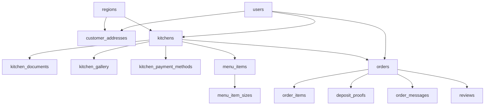

# Database Schema - تطبيق تكة

## 1. الهدف من الوثيقة
هذه الوثيقة تحدد نموذج البيانات الأساسي للنسخة الأولى `MVP` من تطبيق `تكة`، وتشمل:

- الكيانات الرئيسية
- الحقول الأساسية
- العلاقات بين الكيانات
- القواعد المهمة على مستوى البيانات
- نقاط قابلة للتوسع لاحقًا

---

## 2. مبادئ التصميم
- كل طلب يرتبط بـ `مطبخ واحد فقط`
- كل عميل يمكنه امتلاك `عدة عناوين`
- كل مطبخ يجب أن يمر بحالة `اعتماد إداري`
- العربون إلزامي لكل طلب
- قيمة العربون لا تتجاوز `60%` من إجمالي الطلب
- المحادثة مرتبطة بالطلب
- التقييم مرتبط بطلب مكتمل

---

## 3. الكيانات الرئيسية

1. `users`
2. `customer_addresses`
3. `kitchens`
4. `kitchen_documents`
5. `kitchen_gallery`
6. `kitchen_payment_methods`
7. `regions`
8. `menu_items`
9. `menu_item_sizes`
10. `orders`
11. `order_items`
12. `deposit_proofs`
13. `order_messages`
14. `reviews`
15. `admin_actions`

---

## 4. الكيانات بالتفصيل

### 4.1 users
يمثل جميع المستخدمين داخل النظام.

**الحقول الأساسية:**
- `id`
- `role`  
  القيم: `customer`, `kitchen_owner`, `admin`
- `full_name`
- `phone_number`
- `password_hash`
- `is_active`
- `created_at`
- `updated_at`

**ملاحظات:**
- يمكن استخدام هذا الجدول كأساس لكل المستخدمين.
- بيانات المطبخ التفصيلية لا توضع هنا بل في جدول `kitchens`.

---

### 4.2 customer_addresses
يحفظ عناوين العملاء.

**الحقول الأساسية:**
- `id`
- `customer_id` → `users.id`
- `label`  
  مثال: منزل، عمل، عنوان والدتي
- `city_name`
- `region_id` → `regions.id`
- `address_line`
- `landmark`
- `latitude`
- `longitude`
- `is_default`
- `created_at`
- `updated_at`

**العلاقة:**
- العميل الواحد لديه عدة عناوين

---

### 4.3 kitchens
يمثل بيانات المطبخ التجارية والتشغيلية.

**الحقول الأساسية:**
- `id`
- `owner_user_id` → `users.id`
- `kitchen_name`
- `slug`
- `description`
- `logo_url`
- `cover_image_url`
- `phone_number`
- `city_name`
- `region_id` → `regions.id`
- `address_line`
- `latitude`
- `longitude`
- `approval_status`  
  القيم: `pending`, `approved`, `rejected`
- `availability_status`  
  القيم: `open`, `closed`
- `average_rating`
- `reviews_count`
- `created_at`
- `updated_at`

**ملاحظات:**
- لا يظهر المطبخ للعميل إلا إذا كان:
  - `approved`
  - `open`

---

### 4.4 kitchen_documents
يحفظ مستندات اعتماد المطبخ.

**الحقول الأساسية:**
- `id`
- `kitchen_id` → `kitchens.id`
- `document_type`  
  مثال: `national_id`
- `file_url`
- `verification_status`  
  القيم: `pending`, `approved`, `rejected`
- `review_notes`
- `created_at`
- `updated_at`

**ملاحظات:**
- في النسخة الأولى المستند الأساسي هو صورة البطاقة الشخصية.

---

### 4.5 kitchen_gallery
يحفظ صور المطبخ الإضافية.

**الحقول الأساسية:**
- `id`
- `kitchen_id` → `kitchens.id`
- `image_url`
- `sort_order`
- `created_at`

---

### 4.6 kitchen_payment_methods
يحفظ بيانات استقبال العربون.

**الحقول الأساسية:**
- `id`
- `kitchen_id` → `kitchens.id`
- `payment_type`  
  القيم: `instapay`
- `account_name`
- `account_number_or_handle`
- `payment_link`
- `is_active`
- `created_at`
- `updated_at`

**ملاحظات:**
- في النسخة الأولى يدعم `InstaPay` فقط.

---

### 4.7 regions
يمثل المدن والأحياء والمناطق المدعومة.

**الحقول الأساسية:**
- `id`
- `city_name`
- `region_name`
- `is_active`
- `created_at`
- `updated_at`

**ملاحظات:**
- يمكن لاحقًا فصل المدن عن الأحياء في جدولين مستقلين إذا زاد التعقيد.

---

### 4.8 menu_items
يمثل الأصناف الأساسية في منيو المطبخ.

**الحقول الأساسية:**
- `id`
- `kitchen_id` → `kitchens.id`
- `name`
- `description`
- `image_url`
- `base_price`
- `deposit_amount`
- `is_available`
- `sort_order`
- `created_at`
- `updated_at`

**ملاحظات:**
- `deposit_amount` يجب التحقق منه بحسب إجمالي الطلب والسياسة المعتمدة.
- يمكن أن يكون العربون على مستوى الصنف في هذه المرحلة.

---

### 4.9 menu_item_sizes
خيارات الأحجام الخاصة بالصنف.

**الحقول الأساسية:**
- `id`
- `menu_item_id` → `menu_items.id`
- `size_name`  
  مثال: صغير، وسط، كبير
- `price`
- `deposit_amount`
- `is_active`
- `created_at`
- `updated_at`

**ملاحظات:**
- هذا الجدول اختياري للصنف الذي لديه أحجام فقط.

---

### 4.10 orders
يمثل الطلب الرئيسي.

**الحقول الأساسية:**
- `id`
- `order_number`
- `customer_id` → `users.id`
- `kitchen_id` → `kitchens.id`
- `delivery_type`  
  القيم: `pickup`, `delivery`
- `customer_address_id` → `customer_addresses.id`  
  nullable إذا كان `pickup`
- `region_id` → `regions.id`
- `subtotal_amount`
- `delivery_fee`
- `total_amount`
- `deposit_amount`
- `currency_code`
- `status`
- `customer_notes`
- `kitchen_notes`
- `cancelled_by`
- `cancel_reason`
- `placed_at`
- `accepted_at`
- `deposit_submitted_at`
- `deposit_confirmed_at`
- `completed_at`
- `cancelled_at`
- `created_at`
- `updated_at`

**قيم status المقترحة:**
- `pendingKitchenApproval`
- `acceptedAwaitingDeposit`
- `depositProofSubmitted`
- `depositConfirmed`
- `preparing`
- `readyForPickup`
- `awaitingCustomerArrival`
- `outForDelivery`
- `deliveredByKitchenOrDriver`
- `completedAwaitingCustomerConfirm`
- `completed`
- `cancelledBeforeDeposit`
- `cancelledAfterDeposit`
- `rejectedByKitchen`

**ملاحظات:**
- الطلب الواحد يتبع مطبخًا واحدًا فقط.
- يجب تثبيت السعر والإجمالي والعربون عند مراحل واضحة من الطلب.

---

### 4.11 order_items
يمثل الأصناف داخل الطلب.

**الحقول الأساسية:**
- `id`
- `order_id` → `orders.id`
- `menu_item_id` → `menu_items.id`
- `menu_item_size_id` → `menu_item_sizes.id`  
  nullable
- `item_name_snapshot`
- `size_name_snapshot`
- `unit_price`
- `deposit_amount`
- `quantity`
- `line_total`
- `customer_note`
- `created_at`

**ملاحظات:**
- نحتفظ بنسخة snapshot من الاسم والسعر حتى لا تتأثر الطلبات القديمة إذا تغير المنيو لاحقًا.

---

### 4.12 deposit_proofs
يحفظ إثباتات العربون المرفوعة من العميل.

**الحقول الأساسية:**
- `id`
- `order_id` → `orders.id`
- `uploaded_by_user_id` → `users.id`
- `image_url`
- `submitted_amount`
- `review_status`  
  القيم: `pending`, `accepted`, `rejected`
- `reviewed_by_user_id` → `users.id`
- `review_notes`
- `submitted_at`
- `reviewed_at`
- `created_at`

**ملاحظات:**
- يمكن السماح بأكثر من إثبات في حالة الرفض وإعادة الرفع.

---

### 4.13 order_messages
رسائل المحادثة الخاصة بالطلب.

**الحقول الأساسية:**
- `id`
- `order_id` → `orders.id`
- `sender_user_id` → `users.id`
- `message_type`  
  القيم: `text`, `image`, `system`
- `message_text`
- `file_url`
- `sent_at`
- `created_at`

**ملاحظات:**
- المحادثة لا تكون متاحة إلا بعد قبول الطلب.

---

### 4.14 reviews
تقييمات العملاء للمطابخ.

**الحقول الأساسية:**
- `id`
- `order_id` → `orders.id`
- `customer_id` → `users.id`
- `kitchen_id` → `kitchens.id`
- `rating_value`
- `comment`
- `is_visible`
- `created_at`
- `updated_at`

**ملاحظات:**
- يسمح بتقييم واحد لكل طلب مكتمل.

---

### 4.15 admin_actions
سجل تدخلات الإدارة.

**الحقول الأساسية:**
- `id`
- `admin_user_id` → `users.id`
- `target_type`  
  مثال: `kitchen`, `order`, `review`, `region`
- `target_id`
- `action_type`
- `action_notes`
- `created_at`

**ملاحظات:**
- يفيد في التتبع والمراجعة لاحقًا.

---

## 5. العلاقات بين الكيانات

### العلاقات الأساسية
- `users` 1 --- N `customer_addresses`
- `users` 1 --- 1 `kitchens` من جهة مالك المطبخ
- `kitchens` 1 --- N `kitchen_documents`
- `kitchens` 1 --- N `kitchen_gallery`
- `kitchens` 1 --- N `kitchen_payment_methods`
- `regions` 1 --- N `kitchens`
- `regions` 1 --- N `customer_addresses`
- `kitchens` 1 --- N `menu_items`
- `menu_items` 1 --- N `menu_item_sizes`
- `users` 1 --- N `orders` من جهة العميل
- `kitchens` 1 --- N `orders`
- `orders` 1 --- N `order_items`
- `orders` 1 --- N `deposit_proofs`
- `orders` 1 --- N `order_messages`
- `orders` 1 --- 0..1 `reviews`

---

## 6. مخطط مبسط للعلاقات

---

## 7. قواعد التحقق المهمة

### على مستوى المستخدم
- رقم الهاتف يجب أن يكون فريدًا

### على مستوى المطبخ
- لا يجوز أن يظهر المطبخ في النتائج إذا لم يكن:
  - `approved`
  - `open`

### على مستوى الطلب
- الطلب يجب أن يحتوي على عناصر من مطبخ واحد فقط
- إذا كان `delivery_type = pickup` فلا حاجة إلى `customer_address_id`
- إذا كان `delivery_type = delivery` يجب أن يوجد عنوان
- `deposit_amount <= 60%` من `total_amount`
- لا ينتقل الطلب إلى `preparing` قبل وجود `depositConfirmed`

### على مستوى التقييم
- لا يسمح بإنشاء تقييم إلا إذا كانت حالة الطلب `completed`
- لا يوجد أكثر من تقييم واحد لنفس الطلب

---

## 8. حقول يمكن إضافتها لاحقًا

### users
- `profile_image_url`
- `last_login_at`

### kitchens
- `working_hours`
- `delivery_policy_text`
- `minimum_order_amount`

### orders
- `estimated_ready_time`
- `estimated_delivery_time`
- `platform_fee`
- `discount_amount`

### order_messages
- `is_read`
- `read_at`

### reviews
- `admin_hidden_reason`

---

## 9. ملاحظات معمارية
- يفضل الاحتفاظ بـ `snapshots` داخل الطلبات وعناصر الطلب حتى لا تتغير البيانات التاريخية إذا تغيرت المنيو.
- يفضل فصل مستندات المطبخ ووسائل الدفع في جداول مستقلة لتسهيل التوسع.
- يفضل التعامل مع المناطق كبيانات تشغيلية تديرها الإدارة بدل الاعتماد الكامل على المسافة الجغرافية في النسخة الأولى.

---

## 10. اقتراحات للمرحلة التالية
بعد هذه الوثيقة، أنسب ملف تالٍ هو:

- `Tech-Stack.MD`
أو
- `Modules-and-APIs.MD`

حتى نربط نموذج البيانات بالمعمارية والتنفيذ الفعلي.
